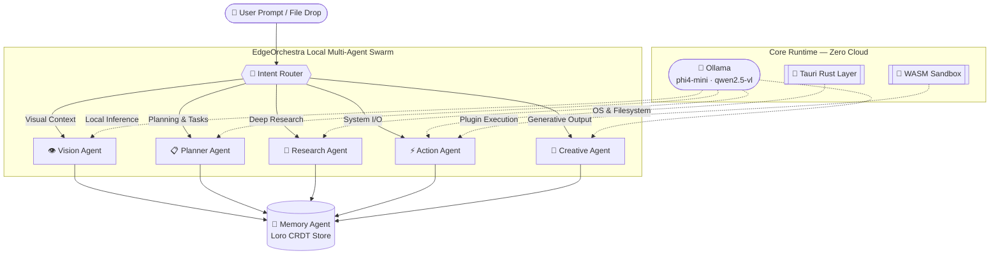

<div align="center">

<br />

# 🌌 EdgeOrchestra AI

### *Your Sovereign Multi-Agent Intelligence Engine*

**Run an entire AI agent network — entirely on your own hardware. Zero cloud. Zero cost. Zero compromise.**

<br />

[](https://opensource.org/licenses/MIT)
[](https://github.com/diyamajee-spec/EdgeOrchestra)
[](https://tauri.app)
[](https://react.dev)
[](https://www.rust-lang.org)
[](https://ollama.com)

<br />

> *"The future of AI is not in the cloud. It's in your hands."*

<br />

</div>

---

## 📖 What is EdgeOrchestra?

**EdgeOrchestra AI** is a privacy-first, local-first multi-agent orchestration platform. It runs a full swarm of specialized AI agents — Vision, Planner, Research, Action, Creative, and Memory — entirely on your own machine, powered by [Ollama](https://ollama.com/) local LLMs.

There is **no server**, **no subscription**, and **no data ever leaves your device**. It is engineered for developers, researchers, and power users who refuse to trade their data sovereignty for AI productivity.

Built on [Tauri 2](https://tauri.app/) (Rust) + [React 19](https://react.dev/) + [Loro CRDT](https://loro.dev/), EdgeOrchestra is not a chatbot wrapper — it is an **autonomous operating system for local AI workloads**.

---

## ✨ Feature Showcase

<table>
  <tr>
    <td width="50%">

### 🧠 Autonomous Agent Graph
A dynamic intent router parses natural language and constructs a live dependency graph, automatically delegating workloads across six specialist agents: **Vision**, **Planner**, **Research**, **Action**, **Creative**, and **Memory**.

</td>
    <td width="50%">

### ⚡ Full Orchestra Burst Mode
Trigger parallel execution across all agents simultaneously, saturating local silicon by spawning concurrent Web Workers. All outputs are merged into a single cohesive response via the Memory CRDT.

</td>
  </tr>
  <tr>
    <td width="50%">

### 🎯 Interactive Drag & Drop Graph
The agent network is not a black box — it's a fully interactive [ReactFlow](https://reactflow.dev/) canvas. Drag local files or images directly onto agent nodes to trigger targeted, offline analysis.

</td>
    <td width="50%">

### 🔊 Cinematic Boot & Haptic Audio
A 4-second cinematic Matrix code-rain boot sequence greets you on launch. The embedded chat terminal uses the Web Audio API to emit synthesized mechanical key-clicks for every log event — no dependencies, pure physics.

</td>
  </tr>
  <tr>
    <td width="50%">

### 💻 Real-Time IPC DevTools Inspector
Press `Ctrl+Shift+I` to slide up the live DevTools panel. Observe raw Tauri IPC events, Memory CRDT hex allocations, and Loro state synchronization logs fly by in real time as agents communicate.

</td>
    <td width="50%">

### 🎨 Cinematic Theme Engine
Swap the visual identity of the platform on the fly. Toggle between **Cyan Core**, **Matrix Green**, and **Vaporwave** modes — powered by a fully custom CSS Variable Engine with zero-overhead runtime theming.

</td>
  </tr>
  <tr>
    <td width="50%">

### 🧩 WASM Plugin Sandbox
Extend EdgeOrchestra with third-party agents that compile to `wasm32-unknown-unknown`. Plugins execute inside a hardened WebAssembly VM with no OS access, no network sockets, and auditable I/O payloads.

</td>
    <td width="50%">

### 📸 Multimodal Vision Pipeline
Capture webcam frames directly in the chat console and pipe them to the **Vision Agent** (`qwen2.5-vl`). Analyze images, screenshots, and documents entirely offline with a single click.

</td>
  </tr>
</table>

---

## 🏗️ Architecture



---

## 🛠️ Tech Stack

| Layer | Technology | Role |
|---|---|---|
| **Desktop Runtime** | Tauri 2 (Rust) | Lightweight OS bridge, secure sandboxing, and zero-copy IPC |
| **Frontend Framework** | React 19 + TypeScript | Type-safe, component-driven UI architecture |
| **Styling & Animation** | Tailwind CSS v4 + Framer Motion | Glassmorphism design system with spring-physics animations |
| **Local AI Inference** | Ollama (`phi4-mini`, `qwen2.5-vl`) | 100% on-device LLM and multimodal vision inference |
| **State & Memory** | Zustand + Loro CRDT | Conflict-free, offline-capable replicated memory store |
| **Agent Visualization** | ReactFlow / XYFlow | Interactive, draggable node-based agent graph |
| **Plugin Runtime** | WebAssembly (`wasm32-unknown-unknown`) | Sandboxed, capability-restricted agent extension system |
| **UI Primitives** | Radix UI + Lucide Icons | Accessible, headless component foundation |
| **Speech I/O** | Web Speech API (STT + TTS) | Fully offline voice interaction layer |

---

## 🚀 Quick Start

### Prerequisites

| Tool | Version | Link |
|---|---|---|
| Node.js | v18+ | [nodejs.org](https://nodejs.org/) |
| Rust & Cargo | Latest stable | [rust-lang.org](https://www.rust-lang.org/tools/install) |
| Ollama | Latest | [ollama.com](https://ollama.com/) |

### 1 — Clone & Install

```bash
git clone https://github.com/diyamajee-spec/EdgeOrchestra.git
cd EdgeOrchestra
npm install
```

### 2 — Pull Local AI Models

Start the Ollama daemon, then pull the two required models:

```bash
# General-purpose fast reasoning agent
ollama pull phi4-mini

# Multimodal vision agent (image & webcam analysis)
ollama pull qwen2.5-vl:7b
```

### 3 — Launch the Matrix

```bash
npm run tauri dev
```

> **One-click setup?** Run `install.ps1` (Windows) or `setup.sh` (Linux/macOS) for automated dependency installation including Ollama.

---

## 🗺️ Roadmap

| Phase | Status | Description |
|---|---|---|
| **Phase 1:** Local Foundations | ✅ Complete | Tauri 2 + React 19, Ollama streaming, ReactFlow agent graph |
| **Phase 2:** Multimodal & Memory | ✅ Complete | Webcam vision, Loro CRDT memory, STT/TTS voice I/O |
| **Phase 3:** WASM Plugin System | ✅ Complete | Sandboxed plugins, Sandbox console with memory & latency HUD |
| **Phase 4:** P2P Sync | 🔄 Planned | Serverless Loro state sync over local Wi-Fi via BLE/mDNS |
| **Phase 5:** Energy-Aware Routing | 🔄 Planned | Dynamic model downscaling based on battery & thermal data |
| **Phase 6:** Native Piper TTS | 🔄 Planned | Rust-layer Piper TTS replacing Web Speech API entirely |

---

## 🤝 Contributing

Contributions are welcome and highly appreciated. Please read [CONTRIBUTING.md](./CONTRIBUTING.md) and [CODE_OF_CONDUCT.md](./CODE_OF_CONDUCT.md) before opening a pull request.

```bash
# Fork the repo, then:
git checkout -b feature/your-idea
npm run dev        # Vite browser preview
npm run tauri dev  # Full Tauri desktop build
npm run test       # Vitest test suite
npm run lint       # ESLint check
```

---

## 📄 License

Distributed under the **MIT License**. See [`LICENSE`](./LICENSE) for details.

---

<div align="center">

**Built entirely offline. Not a single byte of your data touched a cloud server.**

*Made with 🦀 Rust · ⚛️ React · 🧠 Ollama · 🔒 Privacy by Design*

<br />

[](https://github.com/diyamajee-spec/EdgeOrchestra)

</div>
