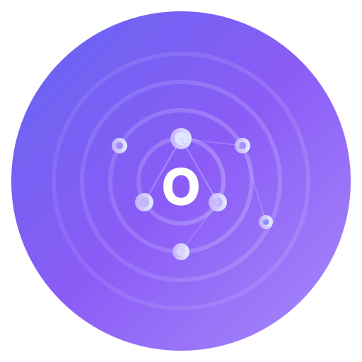
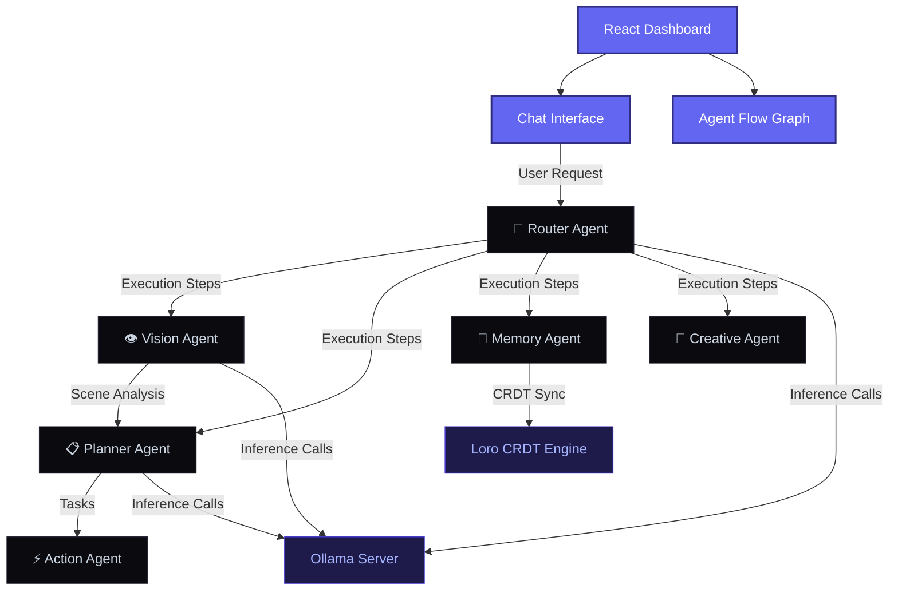

<div align="center">
  
  <h1>Orchestra AI</h1>
  <p><strong>Edge AI Personal Agent Orchestra</strong></p>
  <p><em>Local-First · Privacy-Preserving · Multimodal · Multi-Agent Platform</em></p>
  
  <p>
    <a href="#-features">Features</a> •
    <a href="#-quick-start">Quick Start</a> •
    <a href="#-architecture">Architecture</a> •
    <a href="#-agent-roles">Agent Roles</a> •
    <a href="#-contributing">Contributing</a>
  </p>

  <hr />
</div>

## 📌 Overview

**Orchestra AI** is an advanced, privacy-preserving, multimodal multi-agent platform designed to run entirely on the user's local device. Multiple specialized AI agents (Router, Vision, Planner, Memory, Research, Action, Creative) collaborate seamlessly like an orchestra to fulfill complex user queries, automate tasks, and manage persistent memory—all offline by default using edge-optimized models via [Ollama](https://ollama.com).

---

## ⚡ Key Features

* **🎯 Intelligent Orchestration:** A centralized Router (phi4-mini) decomposes complex queries into multi-step execution plans and delegates them to specialist agents.
* **👁️ Multimodal Capabilities:** Seamless processing of text, webcam streams, screenshots, and custom files using local vision models (qwen2.5-vl or moondream).
* **🧠 Synced Local Memory:** Infinite-history, privacy-preserving shared memory using state-of-the-art Loro CRDT sync across devices and sessions.
* **🔌 Extensible Architecture:** Build custom specialized agents using standard Rust compiled to high-performance WebAssembly (WASM) plugins.
* **📊 Visual Control Center:** Beautiful React Flow agent orchestration graphs and real-time system/memory visualizations.
* **🔒 absolute Privacy:** 100% on-device execution. Zero external API calls, zero telemetry, and zero cloud tracking.

---

## 🚀 Quick Start

Ensure you have the following prerequisites installed:
* **Node.js** v20+
* **Rust** v1.75+ (for Tauri desktop client)
* **Ollama** ([Download here](https://ollama.com))

### 1. Installation

```bash
# Clone the repository
git clone https://github.com/your-org/orchestra-ai.git
cd orchestra-ai

# Install dependencies
npm install
```

### 2. Configure Local Models

Start Ollama on your system:
```bash
ollama serve
```

In another terminal, download the optimized models:
```bash
ollama pull phi4-mini
ollama pull moondream
```
*Note: You can also spin up the entire Ollama + vector database environment via `docker compose up -d`.*

### 3. Start Development Mode

```bash
# Start frontend only (Browser mode)
npm run dev

# Start full desktop app (Tauri mode)
npm run tauri dev
```

---

## 🏗️ Architecture



---

## 🎭 Agent Roles & Capabilities

| Agent | Model | Primary Capabilities |
| :--- | :--- | :--- |
| **🎯 Router** | `phi4-mini` | Conductor, intent classification, plan generation, task delegation |
| **👁️ Vision** | `moondream` | Spatial object detection, scene understanding, document OCR, webcam analysis |
| **📋 Planner** | `phi4-mini` | Eisenhower prioritization, time estimation, schedule creation, smart time-blocking |
| **🧠 Memory** | `phi4-mini` | Fact extraction, user preference learning, CRDT sync, context retrieval |
| **🔬 Research** | `phi4-mini` | Reasoning, local knowledge base synthesis, document analysis |
| **⚡ Action** | `phi4-mini` | System command execution, secure file organization, custom notifications |
| **🎨 Creative** | `phi4-mini` | Creative content writing, code generation, ideas brainstorming |

---

## 📁 Repository Structure

```
orchestra-ai/
├── src/                          # React TypeScript Frontend
│   ├── agents/                   # Agent configurations & system prompts
│   ├── components/               # UI views (Dashboard, Chat, Memory, Settings)
│   │   ├── agents/               # Agent status cards & Flow Graph
│   │   ├── layout/               # Sidebar navigation & Header bar
│   │   └── chat/                 # Interactive chat & webcam client
│   ├── store/                    # Zustand global application state
│   └── types/                    # TypeScript interfaces
├── src-tauri/                    # Tauri 2 Desktop Rust Backend
│   └── src/
│       ├── agents.rs             # Local intent classification & planning
│       ├── commands.rs           # Tauri command bridge endpoints
│       └── ollama.rs             # Local Ollama integration client
├── plugins/                      # WASM Custom Agent template
├── docker-compose.yml            # Pre-configured containerized services
└── README.md                     # Project documentation
```

---

## 🛠️ Technology Stack

* **Frontend:** React 19, TypeScript, Vite, Tailwind CSS v4, Zustand 5, React Flow, Framer Motion
* **Desktop Wrapper:** Tauri 2 (Rust)
* **Local Inference:** Ollama HTTP API
* **Sync & CRDT:** Loro CRDT Engine
* **Containerization:** Docker Compose

---

## 🏷️ Good First Issues

If you're looking to contribute to the local agent ecosystem, here are excellent starter issues:

- [ ] **Voice-to-Text Input:** Integrate the browser Web Speech API for voice interactions.
- [ ] **Keyboard Shortcuts:** Add standard commands like `Ctrl+K` for command palette and `Ctrl+Enter` to submit.
- [ ] **Memory search:** Add filter queries to search through persistent memory nodes.
- [ ] **Dark/Light Theme Toggle:** Implement dynamic CSS variable switching.
- [ ] **Export Chat:** Export chat history directly as raw Markdown or JSON documents.

---

## 🔒 Privacy & Safety

* **Offline-First:** No telemetry, tracking, or network collection. Your queries are never sent to external servers.
* **On-Device Storage:** Memory vector databases, configuration, and CRDT tables reside 100% on your machine.
* **Safe Actions:** Secure execution boundary. Medium to high-risk system commands require manual user confirmation.

---

## 📜 License

Distributed under the MIT License. See [LICENSE](LICENSE) for more details.

<div align="center">
  <p><sub>Orchestra AI is crafted with ❤️ for the privacy and local AI community.</sub></p>
</div>
