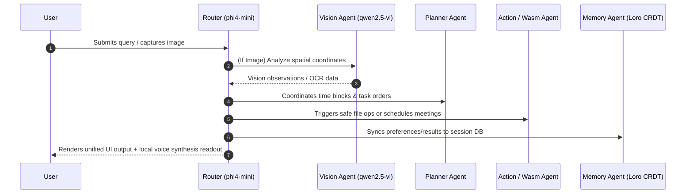

# 🎯 EdgeOrchestra AI

<div align="center">

<h3>🎻 Your Personal AI Orchestra — 100% Local, Private & Multimodal 🎻</h3>

[](LICENSE)
[](https://github.com/diyamajee-spec/EdgeOrchestra)
[](https://ollama.com)
[](https://loro.dev)
[](#wasm-plugins)

<p align="center">
  A local-first, privacy-preserving multi-agent desktop orchestra powered by Tauri 2 + React 19 + TypeScript + Ollama. EdgeOrchestra AI coordinates specialized offline models to execute complex multi-step workflows entirely on your own device.
</p>

[✨ Try a Showcase](#interactive-showcase) • [🚀 One-Command Install](#quick-start) • [🏗️ Architecture](#system-architecture) • [🧩 Wasm Plugins](#wasm-plugins)

</div>

---

## 📷 Screenshots

### 📊 Performance Dashboard & Visual Agent Flow
*Capture real-time token metrics, latency, and collaborative execution graph.*


### 💬 Multimodal Chat & Vision Handoffs
*Capture frames directly via webcam and coordinate specialist agents.*


---

## 🌟 Key Features

*   **100% On-Device & Offline**: No cloud APIs, no telemetry, and zero network data leaks. All inference is run locally via Ollama.
*   **Multimodal Collaborators**: Captures live device sensors (e.g. webcam) to perform spatial and visual audits using `qwen2.5-vl`.
*   **Visual Agent Graph**: React Flow coordinates a router agent (`phi4-mini`) which builds execution plans, delegating to specialized research, planning, action, and creative agents.
*   **Persistent CRDT Memory**: Synchronized state and persistent history using the Loro CRDT framework, providing conflict-free replication across devices.
*   **Wasm Plugin Sandbox**: Safely extend capabilities with sandboxed WebAssembly plugins written in Rust or AssemblyScript.
*   **Performance Metrics Dashboard**: Real-time visualization of token speeds, inference latency, memory allocations, and agent collaboration steps.
*   **Voice Input & Text-to-Speech**: Built-in voice transcription and offline speech synthesis readouts for complete hands-free interaction.

---

## 🚀 Quick Start

### One-Command Setup

Get EdgeOrchestra AI up and running in seconds. The installer automatically downloads Ollama, pulls the primary models, validates system dependencies, and installs npm packages.

#### 🪟 Windows (PowerShell)
```powershell
Set-ExecutionPolicy Bypass -Scope Process -Force; [System.Net.ServicePointManager]::SecurityProtocol = [System.Net.SecurityProtocolType]::Tls12; iex ((New-Object System.Net.WebClient).DownloadString('https://raw.githubusercontent.com/diyamajee-spec/EdgeOrchestra/main/install.ps1'))
```
*(Or run `.\install.ps1` from the project directory).*

#### 🍎 macOS / 🐧 Linux (Bash)
```bash
curl -fsSL https://raw.githubusercontent.com/diyamajee-spec/EdgeOrchestra/main/setup.sh | bash
```
*(Or run `./setup.sh` from the project directory).*

### Manual Commands
If you prefer running manual commands:
1. Ensure Ollama is running and pull the models:
   ```bash
   ollama pull phi4-mini
   ollama pull qwen2.5-vl
   ```
2. Install dependencies & run:
   ```bash
   npm install
   npm run tauri dev
   ```

---

## 🏗️ System Architecture

EdgeOrchestra AI uses a hub-and-spoke multi-agent coordination model. The Router agent (using `phi4-mini`) acts as the orchestrator, determining which specialist agents are needed to fulfill a request.



### Data Synchronization & Conflict Resolution (CRDT)
Local state is modeled using **Loro CRDTs**. This ensures that if you run EdgeOrchestra AI on multiple devices (macOS/Windows), syncing data (like memory keys and configuration items) requires no centralized database. State changes can be exported as raw delta byte arrays and merged instantly and deterministically.

---

## 🧩 Wasm Plugins

Custom capabilities can be built using our WebAssembly plugin templates:
- **Calendar & Task Manager** (`plugins/calendar`): Extract dates, schedules, and priority workflows.
- **Smart File Organizer** (`plugins/file_organizer`): Safely group files, scan download directories, and trigger space cleanups.
- **Web Search Fallback** (`plugins/web_search`): Executes keyword fallback APIs when online results are explicitly requested.

### Build and Load
1. Write logic inside `src/lib.rs` (exposed functions: `process`, `get_info`, `alloc`, `dealloc`).
2. Build to Wasm:
   ```bash
   cargo build --target wasm32-unknown-unknown --release
   ```
3. Load the output `.wasm` file using the **Plugin Manager** page in the application.

---

## 📜 License

This project is licensed under the MIT License - see the [LICENSE](LICENSE) file for details.
