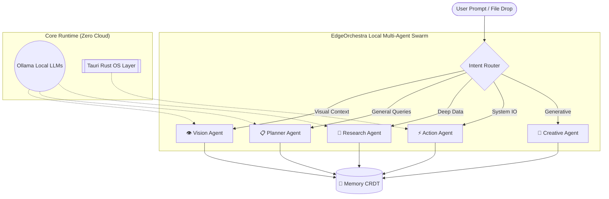

<div align="center">
  
  
  

  <br />
  <br />

  <h1 align="center">🌌 EdgeOrchestra AI</h1>
  <p align="center">
    <strong>The Ultimate Local-First Autonomous Agent Matrix</strong>
    <br />
    <em>Developed for the Win Elite Coders Open Source Hackathon</em>
  </p>
</div>

<br />

## 📖 Overview

**EdgeOrchestra AI** is an advanced, privacy-first multi-agent orchestration platform designed to run entirely on local hardware. By coupling native WebAssembly (Wasm) execution environments with local LLM inference engines (like Ollama), EdgeOrchestra guarantees **100% data privacy**, **zero cloud-latency**, and **complete offline autonomy**.

Unlike traditional cloud-based AI tools that compromise your proprietary data, EdgeOrchestra routes complex tasks through a local network of highly specialized AI agents—all communicating via zero-copy IPC memory streams.

---

## ✨ Core Hackathon Features

### 🧠 Autonomous Agent Graph
A dynamic, intelligent router that parses natural language intent and constructs real-time execution dependencies. It automatically delegates workloads across a swarm of specialized local agents: **Vision**, **Planner**, **Research**, **Action**, **Creative**, and **Memory**.

### 🚀 Full Orchestra Parallel Burst
By triggering the *Full Orchestra Burst Mode*, the router unlocks parallel constraints and spawns concurrent Web Workers. This stress-tests local silicon by executing all 5 specialist agents simultaneously, merging their outputs into a single, cohesive workflow.

### 🎯 Interactive Workspace (Drag & Drop)
The system architecture isn't hidden behind a black box—it is fully interactive. Drag and drop local files or images directly onto the interactive ReactFlow **Agent Graph nodes** to instantly trigger targeted, offline data analysis.

### 🎨 Cinematic Color Core Engine
A fully custom CSS Variable Engine allows users to instantly swap the visual identity of the matrix. Toggle between the pristine **Cyan Core**, the heavily-contrasted **Matrix Green**, or the vibrant **Vaporwave** modes on the fly.

### 💻 Raw IPC Inspector (DevTools)
Press `Ctrl + Shift + I` (or `Cmd + Shift + I`) anywhere in the application to slide up the **DevTools Inspector**. Watch raw IPC events, Memory hex allocations, and `Loro` CRDT state synchronization logs fly by in real-time as the agents communicate.

### 🔊 Haptic Audio & Cinematic Boot
Experience a 4-second cinematic system boot sequence featuring a Matrix code-rain background and a hardware profiler HUD. Inline chat terminals feature zero-dependency Web Audio API oscillators, emitting synthesized mechanical clicks for every log printed.

---

## 🏗️ Technical Architecture



### Stack Matrix

EdgeOrchestra is built on a modern, high-performance tech stack engineered for offline superiority:
| Layer | Technology | Purpose |
|-------|------------|---------|
| **Frontend Framework** | React + TypeScript | Robust, type-safe component architecture. |
| **Styling & Physics** | Tailwind CSS v4 + Framer Motion | High-fidelity glassmorphism, dynamic theming, and buttery-smooth cubic-bezier spring animations. |
| **Desktop Runtime** | Tauri (Rust) | Lightweight OS-level operations, secure sandboxing, and zero-copy file system access. |
| **Local Inference** | Ollama | On-device hosting of LLMs (`phi4-mini`, `qwen2.5-vl`). |
| **State Management** | Zustand + Loro | Conflict-free Replicated Data Types (CRDTs) for offline-capable P2P memory synchronization. |
| **Data Visualization** | ReactFlow / XYFlow | Interactive, node-based agent relationship mapping. |

---

## 🚀 Quick Start Guide

### 1. Prerequisites
Ensure you have the following installed on your machine:
- [Node.js](https://nodejs.org/) (v18+)
- [Rust & Cargo](https://www.rust-lang.org/tools/install)
- [Ollama](https://ollama.com/) (Required for local agent inference)

### 2. Clone & Install
```bash
git clone https://github.com/diyamajee-spec/EdgeOrchestra.git
cd EdgeOrchestra
npm install
```

### 3. Provision Local AI Models
Start the Ollama daemon in your terminal, then pull the required specialist models:
```bash
ollama pull phi4-mini
ollama pull qwen2.5-vl:7b
```

### 4. Ignite the Matrix
```bash
npm run tauri dev
```

---

## 🎮 Live Demonstration Guide

When showcasing EdgeOrchestra to the judges, follow this sequence to maximize impact:

1. **The Cold Boot:** Launch the application and let the judges observe the 4-second cinematic boot sequence, hardware profiler HUD, and Matrix code rain.
2. **The IPC Inspector:** Immediately press `Ctrl + Shift + I` to reveal the hidden terminal drawer and demonstrate the live system logging.
3. **Parallel Execution:** Navigate to the **Showcase** tab and click **Launch Workflow** under the `Full Orchestra Parallel Burst` card. Watch the chat UI pop open the Process Analyzer, accompanied by synthesized audio haptics.
4. **Interactive Graph Injection:** Return to the **Dashboard**, slightly minimize the window, and drag an image from your desktop directly onto the **Vision Node** to autonomously trigger the visual-language model.

---

## 🤝 Contributing

We welcome contributions from the elite coding community. Please see our [CONTRIBUTING.md](./CONTRIBUTING.md) and [CODE_OF_CONDUCT.md](./CODE_OF_CONDUCT.md) for guidelines on how to submit pull requests, report bugs, and propose new features.

---

## 📄 License

This project is licensed under the **MIT License**. 

*Built entirely offline. No cloud APIs were harmed in the making of this project.*
