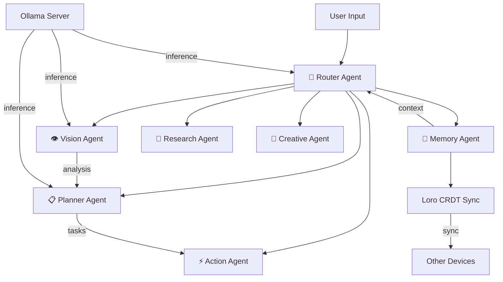

# Architecture

## System Overview

Orchestra AI is a local-first, privacy-preserving multimodal AI agent platform. All inference runs on-device via Ollama.

## Agent Architecture

## Tech Stack

| Layer | Technology |
|-------|-----------|
| Frontend | React 19 + TypeScript + Vite |
| Styling | Tailwind CSS v4 + Framer Motion |
| State | Zustand |
| Visualization | React Flow |
| Desktop | Tauri 2 (Rust) |
| AI Inference | Ollama (local) |
| Memory Sync | Loro CRDT |
| Vector Store | ChromaDB (optional) |
| Plugins | WASM (Rust → WebAssembly) |

## Data Flow

1. **User Input** → Text, image, voice, or file
2. **Router Agent** → Classifies intent, creates orchestration plan
3. **Specialist Agents** → Execute plan steps (possibly in parallel)
4. **Memory Agent** → Stores context for future sessions
5. **Response** → Aggregated results displayed in chat

## Privacy Model

- All processing happens on-device
- No telemetry or analytics
- CRDT sync is peer-to-peer (no cloud)
- Models run locally via Ollama
